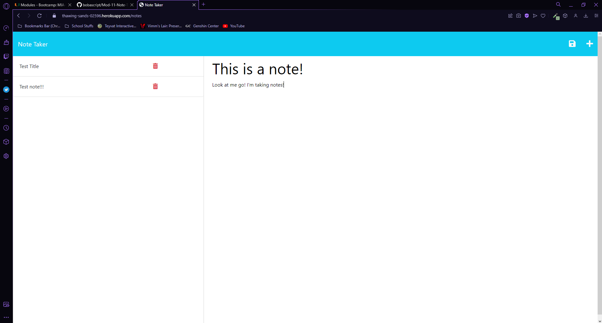

# Module 11 Challenge: Note Taker

## User Story

```
AS A small business owner
I WANT to be able to write and save notes
SO THAT I can organize my thoughts and keep track of tasks I need to complete
```


## Acceptance Criteria

```
GIVEN a note-taking application
WHEN I open the Note Taker
THEN I am presented with a landing page with a link to a notes page
WHEN I click on the link to the notes page
THEN I am presented with a page with existing notes listed in the left-hand column, plus empty fields to enter a new note title and the note’s text in the right-hand column
WHEN I enter a new note title and the note’s text
THEN a Save icon appears in the navigation at the top of the page
WHEN I click on the Save icon
THEN the new note I have entered is saved and appears in the left-hand column with the other existing notes
WHEN I click on an existing note in the list in the left-hand column
THEN that note appears in the right-hand column
WHEN I click on the Write icon in the navigation at the top of the page
THEN I am presented with empty fields to enter a new note title and the note’s text in the right-hand column
```

## Usage

Upon opening the app, you will find a button that says Get Started. Once pressed, you will be taken to the note taking section! Here, you can give your note a title and write to your hearts content! Once finished, click the little save button at the top of the page to save your note to the side bar, where you will be able to pull it back up at the click of a button! Currently, there is a delete button but it is non functional, but hopefully i can get it working in the near future! 

## Screenshot



## Deployed Page
The page has been deployed to heroku! You can visit it [here](https://thawing-sands-02596.herokuapp.com)
